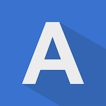

<!--
*** Thanks for checking out the Best-README-Template. If you have a suggestion
*** that would make this better, please fork the repo and create a pull request
*** or simply open an issue with the tag "enhancement".
*** Don't forget to give the project a star!
*** Thanks again! Now go create something AMAZING! :D
-->

<!-- PROJECT SHIELDS -->
<!--
*** I'm using markdown "reference style" links for readability.
*** Reference links are enclosed in brackets [ ] instead of parentheses ( ).
*** See the bottom of this document for the declaration of the reference variables
*** for contributors-url, forks-url, etc. This is an optional, concise syntax you may use.
*** https://www.markdownguide.org/basic-syntax/#reference-style-links
-->

<!-- PROJECT LOGO -->
 

  

<h3 align="center">Alodokter_Rakamin by MeetDoc !</h3>

  

    An mini project that created by MeetDoc (Group 3)
     
    <a href="https://github.com/alba26/alodokter-rakamin-ios-grup3"><strong>Explore the docs »</strong></a>
     
     
  

<!-- TABLE OF CONTENTS -->

  
Table of Contents

  <ol>
    <li>
      <a href="#about-the-project">About The Project</a>
      <ul>
        <li><a href="#built-with">Built With</a></li>
      </ul>
    </li>
    <li>
      <a href="#getting-started">Getting Started</a>
    </li>
    <li><a href="#usage">Usage</a></li>
    <li><a href="#contributing">Contributing</a></li>
    <li><a href="#contact">Contact</a></li>
    <li><a href="#acknowledgments">Acknowledgments</a></li>
  </ol>

<!-- ABOUT THE PROJECT -->
## About The Project

[![Product Name Screen Shot][product-screenshot]](https://example.com)
This is a project that we have been working on for 1 month. The project we are working on is an application that makes it easy for users to read articles about health and schedule consultations anytime and anywhere with doctors. We are working on this application to fulfill the final task of Rakamin Alodokter Bootcamp.

(<a href="#top">back to top</a>)

### Built With

* [UIKit](https://developer.apple.com/documentation/uikit)
* [Swift](https://developer.apple.com/swift/)

(<a href="#top">back to top</a>)

<!-- GETTING STARTED -->
## Getting Started

1. Clone this project
2. Open it on XCode
3. Install the app to your device or simulator
4. No Pods needed

Note : Change to development branch to get updated every day. Main branch only updated on friday. 

(<a href="#top">back to top</a>)

<!-- USAGE EXAMPLES -->
## Usage

(<a href="#top">back to top</a>)

<!-- CONTRIBUTING -->
## Contributing

If you have a suggestion that would make this better, please fork the repo and create a pull request. You can also simply open an issue with the tag "enhancement".
Don't forget to give the project a star! Thanks again!

1. Fork the Project
2. Create your Feature Branch (`git checkout -b feature/AmazingFeature`)
3. Commit your Changes (`git commit -m 'Add some AmazingFeature'`)
4. Push to the Branch (`git push origin feature/AmazingFeature`)
5. Open a Pull Request

(<a href="#top">back to top</a>)

<!-- LICENSE -->

<!-- CONTACT -->
## Contact

Adhitya Laksamana Bayu Adrian - https://www.linkedin.com/in/adhityalba/ - adhityalba@gmail.com - https://adhityalba.myportfolio.com

Project Link: https://github.com/alba26

Aurelia Natasha - https://www.linkedin.com/in/aurelianatasha/ - aurelianatashaaa@gmail.com

Project Link: https://github.com/aurelianatasha

Felinda Gracia Lubis - https://linktr.ee/felindalubis

Finsen Antonius - https://www.linkedin.com/in/finsenantonius/ - finsenantonius42@gmail.com

Project Link : https://github.com/finsenantonius

(<a href="#top">back to top</a>)

<!-- ACKNOWLEDGMENTS -->
## Acknowledgments

* [Human Interface Guidelines](https://developer.apple.com/design/human-interface-guidelines/ios/overview/themes/)
* [MVVM Design Pattern](https://www.raywenderlich.com/34-design-patterns-by-tutorials-mvvm)
* [Session Management in Swift](https://developer.apple.com/documentation/swift/maintaining_state_in_your_apps)

(<a href="#top">back to top</a>)

